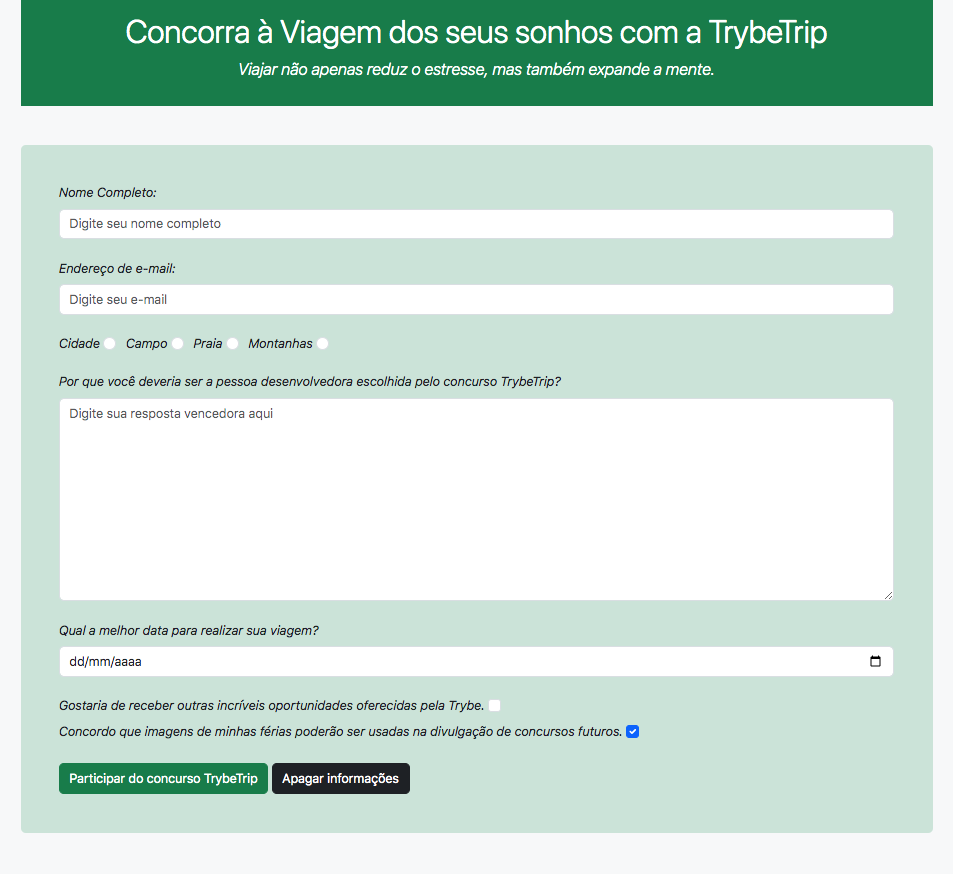

# Boas-vindas ao repositório do projeto TrybeTrip! 🛫

## 💻 Projeto

Neste projeto, desenvolvi um formulário para que as pessoas possam se inscrever e concorrer a uma viagem. O formulário já tinha sido criado por outras pessoas do meu time e minha responsabilidade foi adicionar um framework de estilos para deixar o site mais bonito.

Projeto referente ao bloco HTML e CSS (Forms, Flexbox, Responsivo) do módulo de fundamentos da Trybe https://www.betrybe.com/.

O resultado da aplicação pode ser acessado através da seguinte URL: https://frantend.github.io/trybetrip.

## 🎨 Layout

## 👩‍💻 Requisitos e Habilidades

Estilizar o formulário utilizando framework Bootstrap.
Habilitar o botão "Enviar" após a validação do checkbox utilizando JavaScript.
Testar o código utilizando ESLint e Stylelint.
